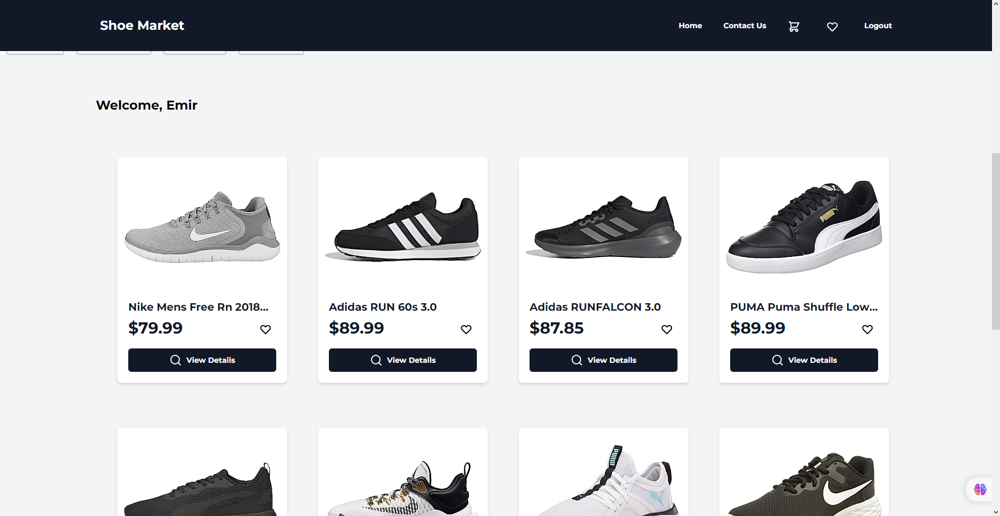

# ShoeMarket - Fullstack E-Commerce for Shoes

ShoeMarket is a fullstack web market application for buying and selling shoes. It allows users to browse and purchase shoes, leave comments and reviews, and add their favorite shoes to their list.



## Table of Contents

- [Features](#features)
- [Demo](#demo)
- [Technologies Used](#technologies-used)
- [Getting Started](#getting-started)
- [Setup](#setup)
- [Usage](#usage)
- [Contributing](#contributing)
- [License](#license)

## Features

- Browse a wide variety of shoes available for purchase
- View detailed information about each shoe, including images, price, and description
- Add shoes to the cart and complete the checkout process
- Leave comments and reviews on shoes
- Add shoes to the user's favorites list
- User registration and login functionality
- Responsive design for mobile and desktop devices

## Demo

A live demo of ShoeMarket is available at [shoe-market-25f4a.web.app](shoe-market-25f4a.web.app)

## Technologies Used

- Vue.js 3 - Frontend framework for building user interfaces
- Tailwind CSS - Utility-first CSS framework for styling
- Express.js - Backend framework for handling API requests
- Firebase - Cloud-based platform for hosting and backend services
- MongoDB - Document-oriented database for data storage
- Mongoose - MongoDB object modeling for Node.js
- Splide.js - Lightweight and flexible carousel/slider library
- JSON Web Token (JWT) - Security technology for authentication and data exchange
- Pinia - We've used Pinia for state management, making our application's data flow smooth and efficient.

## Getting Started

To get a local copy of the project up and running on your machine, follow the steps below.

### Prerequisites

- Node.js and npm installed on your machine
- Firebase account and project set up

### Setup

1. Clone the repository:

```bash
git clone https://github.com/efeturkemir/Shoe-Market.git
cd Shoe-Market
```

2. Install dependencies:

```bash
npm install
```


